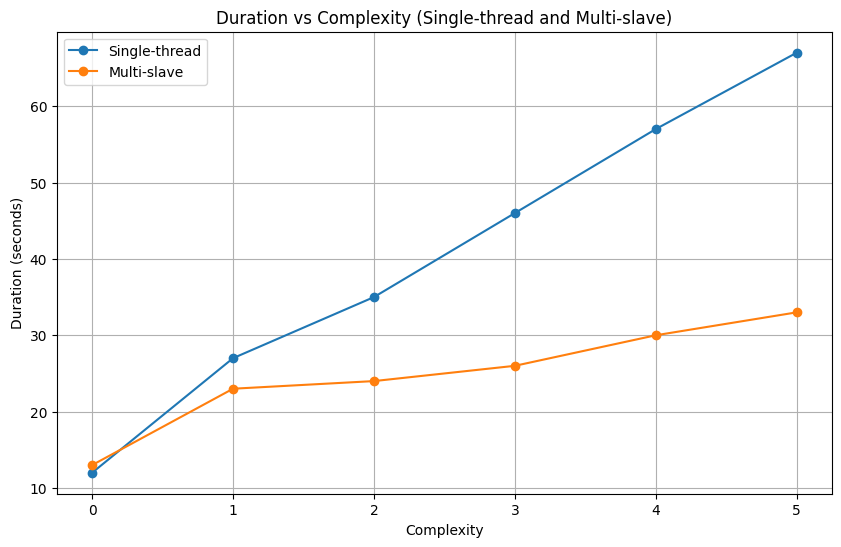
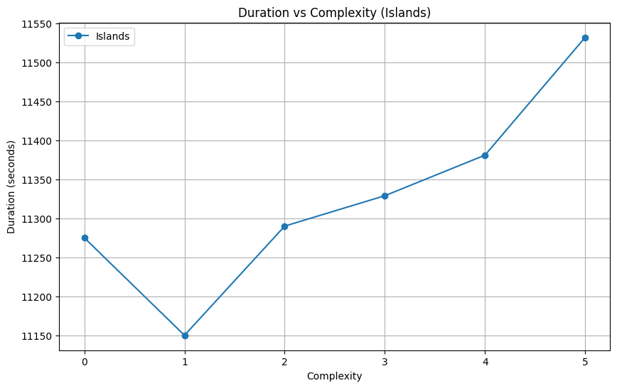

# РАСПРЕДЕЛЕННЫЕ ЭВОЛЮЦИОННЫЕ АЛГОРИТМЫ

Целью данной работы является освоение принципов построенияраспределенных и параллельных эволюционных алгоритмов для повышения их производительности и эффективности.

## Результат запусков
|               | complexity=0     |           | complexity=1     |           | complexity=2     |           |
|---------------|------------------|-----------|------------------|-----------|------------------|-----------|
|               | Время выполнения | Реузльтат | Время выполнения | Реузльтат | Время выполнения | Реузльтат |
| single-thread | 12               | 0,00      | 27               | 7,35      | 35               | 7,37      |
| master-slave  | 13               | 0,00      | 23               | 7,42      | 24               | 7,4       |
| islands       | 11275            | 0,00      | 11150            | 8,07      | 11290            | 8,09      |

|               | complexity=3     |           | complexity=4     |           | complexity=5     |           |
|---------------|------------------|-----------|------------------|-----------|------------------|-----------|
|               | Время выполнения | Реузльтат | Время выполнения | Реузльтат | Время выполнения | Реузльтат |
| single-thread | 46               | 7,37      | 57               | 7,41      | 67               | 7,39      |
| master-slave  | 26               | 7,38      | 30               | 7,48      | 33               | 7,36      |
| islands       | 11329            | 8,09      | 11381            | 8,04      | 11532            | 8,08      |

## Графики

## Ответы на вопросы
1) Лучшая модель алгоритма зависит от конкретной задачи, доступных ресурсов и требований к скорости и точности. Вот некоторые общие соображения:

    - Single-thread алгоритм может быть эффективным для небольших задач, где не требуется параллельной обработки, но может столкнуться с проблемой длительного времени выполнения для больших задач из-за отсутствия параллельности.
    - Multi-slave алгоритм может быть полезным для задач, где возможна параллельная обработка, и доступны вычислительные ресурсы для распараллеливания работы.
    - Islands модель алгоритма может быть эффективной для сложных задач, требующих большого объема вычислительных ресурсов. Она позволяет объединить несколько параллельных запусков генетического алгоритма, что может привести к более быстрому достижению оптимального решения.

2) Увеличение размерности проблемы может оказать различное воздействие на разные модели алгоритмов:

    - Single-thread алгоритмы могут столкнуться с проблемой вычислительной сложности из-за увеличения размерности, что приведет к более долгому времени выполнения.
    - Multi-slave алгоритмы справятся лучше с увеличением размерности, поскольку могут использовать параллельные ресурсы для распределения вычислительной нагрузки.
    - Islands модель алгоритма также может лучше справиться с увеличением размерности, так как разные острова могут работать независимо друг от друга, что позволяет распараллеливать вычисления.

3) Увеличение размера популяции обычно положительно сказывается на эффективности генетических алгоритмов, но влияние может быть разным для различных моделей:

    - Для single-thread алгоритмов увеличение размера популяции может привести к увеличению времени выполнения, так как все вычисления происходят последовательно в одном потоке.
    - В случае multi-slave алгоритмов увеличение размера популяции может помочь распараллелить вычисления и ускорить сходимость к оптимальному решению.
    - Для islands модели увеличение размера популяции может помочь улучшить разнообразие решений на каждом острове и обмен информацией между островами, что может ускорить сходимость.

4) Ограничение на количество островов зависит от доступных ресурсов и конкретных требований к задаче. Обычно количество островов ограничено доступными вычислительными ресурсами и требованиями к времени выполнения. Количество островов может быть выбрано экспериментально, и часто определяется компромиссом между параллелизмом и коммуникационными издержками между островами.